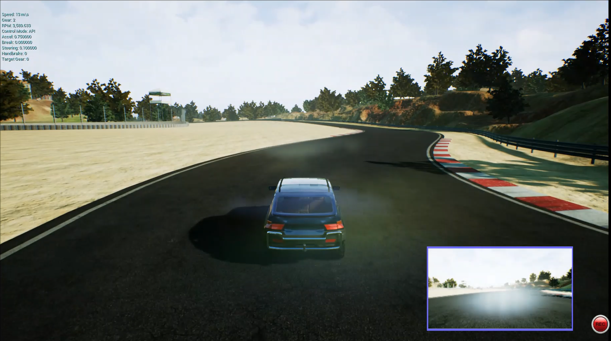
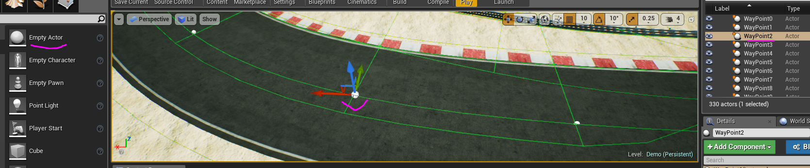

# AirSim-RL
This project provides experiments with Deep Reinforcement Learning on autonomous vehicles (car and uav drone) in [AirSim](https://github.com/microsoft/AirSim). The followings are used to facilitate training models:
*[OpenAI Gym](https://gym.openai.com/)
*[Keras-RL](https://github.com/keras-rl/keras-rl) 
*[Stable Baselines](https://stable-baselines.readthedocs.io/en/master/)
DRL algorithms:
* DQN
* A2C
* PPO2

## Demo 
[](https://youtu.be/oiGjnpcPB_8)
* In this demo, The Deep Q Network (DQN) is used. The reward calculated based on the distance between the car to the center of the track. The episode stops when it is close to off track.
* The input for training is frames of RGB image captured from the head-front camera on car. 

## How do I set up my environment
* Build AirSim, Unreal Engine 4 (UE4) on Windows (https://github.com/microsoft/AirSim/blob/master/docs/build_windows.md)
* Create a new UE4 project with map [RaceCourse](https://github.com/microsoft/AirSim/wiki/build_FSTDriverless_windows)
* Install conda an environment with the important packages: python 3.7, tensorflow 1.14, keras 2.2.5 , keras-rl 0.4.2, gym 0.17.2 (The versions come along are just for reference)
* Arrange some waypoints in the center of the road and name it as "WayPoints[number]" (see the following picture). This list of waypoints is used to locate the road approximately in map. Car's position and waypoints are used in calculate the reward during training. As illustrated below, UE4 'Empty Actors' are used as waypoints. These waypoints are invisible when the game is running.


## How to train
* First take a look in the parameters in Config.ini file to understand some settings, like input image resolution, action space of the agent, etc.
```
# settings related to UE4/airsim 
[airsim_settings] 
image_height = 144
image_width = 256
image_channels = 3
waypoint_regex = WayPoint.*
track_width = 12 

# settings related to training car agent
[car_agent]
# what are adjusted in driving the car
# 0: change steering only, 1(not supported yet): change throttle and steering,
# 2(not supported yet): change throttle, steering, and brake
action_mode = 0 
# steering value from left to right in range [-1, 1] 
# e.g: 0.3 means steering is from -0.3 (left) to 0.3 (right)
steering_max = 0.3
# the granularity of steering range as we use discrete values for steering
# e.g: 7 will produce discrete steering(with max=0.3) actions as: -0.3, -0.2, -0.1, 0.0, 0.1, 0.2, 0.3
steering_granularity = 7 
# car's acceleration, now it is fixed, but will add a range of values later 
fixed_throttle = 0.75 
# total actions of car agent, update this accordingly when changing the above settings
actions = 7 
```
* Then, run the jupyter notebook (or train.py)

## TODO
* Expand action spaces, try more reward functions
* Add OpenAI Gym env for UAV drone

## References
* [create custom open ai gym environment](https://stable-baselines.readthedocs.io/en/master/guide/custom_env.html)
* [training dqn with keras-rl](https://github.com/keras-rl/keras-rl/blob/master/examples/dqn_atari.py) how to use keras-rl with atari game
* https://github.com/Kjell-K/AirGym
* [AWS DeepRacer](https://docs.aws.amazon.com/deepracer/latest/developerguide/what-is-deepracer.html)
